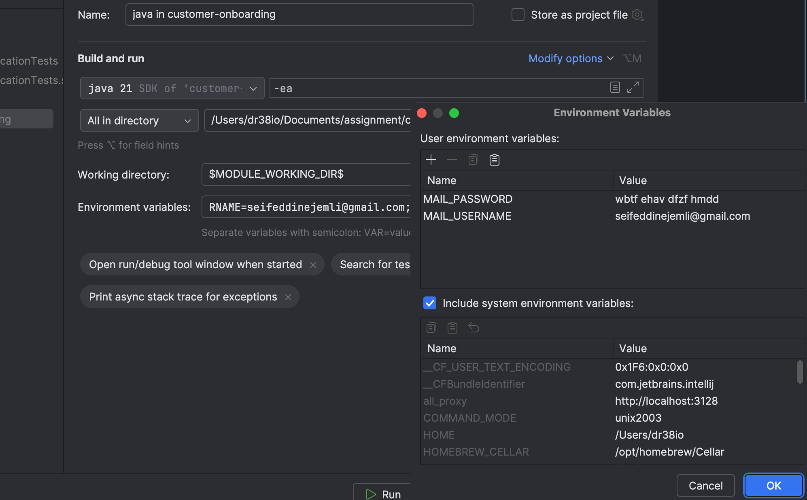

# ABC Bank - Digital Onboarding

This repository contains a production-ready sample implementation of a RESTful onboarding service for ABC Bank.

## Quick start

Requirements:
- Java 21
- Maven 3.8+

Build and run:
```bash

mvn clean package

#in case you want to send emails, you need to set these environment variables. If not set, the notifications will just be logged
export MAIL_USERNAME="seifeddinejemli@gmail.com" 
export MAIL_PASSWORD="wbtf ehav dfzf hmdd"

mvn org.springframework.boot:spring-boot-maven-plugin:run
```
You can also run on Intellij, 




OpenAPI UI (Swagger) after running:
- http://localhost:8080/swagger-ui/index.html
- OpenAPI docs: http://localhost:8080/v3/api-docs


## Customer Onboarding Request Constraints

### Files Constraints

The files need to be smaller than 2MB and of format (pdf, png or jpg)

---

### Field-Level Constraints

#### **First Name & Last Name**
- **Required**: Cannot be blank and must be composed with letters and spaces

---
#### **Gender**
- **Required**: Cannot be null.
- **Allowed Values**: `MALE`, `FEMALE`, `OTHER`.

---
#### **Date of Birth**
- **Must be an adult**: At least **18 years old**.
- **Format**: ISO date (`yyyy-MM-dd`).

---
#### **Phone Number**
- **Required**: Cannot be blank.
- **Pattern**: Dutch format:
    - Starts with `+31` or `0`
    - Followed by 9 digits
    - Example: `+31612345678` or `0612345678`.
---
#### **Email**
- **Required**: Cannot be blank.
- **Valid Email**: Must follow standard email format.

---
#### **Nationality**
- **Required**: Cannot be blank.
- **Pattern**: ISO country code (2 uppercase letters, e.g., `NL`).

---
#### **Residential Address**
- **Required**: Cannot be blank.
- **Free text**: Full address string.

---
#### **Social Security Number (BSN)**
- **Required**: Cannot be blank.
- **Validation**:
    - Must pass **Dutch 11-proef check** .
    - Must have correct length (usually 9 digits).
- These are valid Dutch BSNs that you can use for testing:
  965575238,
  509355201,
  588233237,
  649269858,
  210869355
---

## Key Business Rules
- **Age**: Customer must be **18+ years old**.
- **Phone**: Must be a valid Dutch number.
- **Gender**: Limited to the predefined enum values.
- **BSN**: Must comply with Dutch standards (11-proef + length).

---

## Example of a valid Payload
```json
{
  "firstName": "Seif",
  "lastName": "Jemli",
  "gender": "MALE",
  "dateOfBirth": "1985-05-15",
  "phoneNumber": "+31612345678",
  "email": "seif.jemli@domain.com",
  "nationality": "NL",
  "residentialAddress": "Gustav Mahlerlaan 10, 1082 PP Amsterdam, Netherlands",
  "socialSecurityNumber": "123456782"
}
```

## Account Creation Flow

### 1. Validate Request & Files
- Validate incoming request data (mandatory fields, formats).
- Validate uploaded files (size, type...).

### 2. Generate Bank Account Number
- Generate a new account number.
- If the generated number already exists:
    - Retry **up to 3 times**.
    - Fail if uniqueness cannot be achieved.

### 3. Persist Entity
- Save entity with generated account number and file references.
- If save fails:
    - Rollback transaction.

### 5. Send Notifications (Async)
- Notification are sent by email. If the fromEmail is not configured then only logging happens (falls back to only logs )
- Uses `@Async` annotation.

---

## Technical Notes
- **Transactional Method**: All steps occur inside a `@Transactional` method for atomicity.
- **Async Notifications**: Decouples notification sending from main transaction for better performance.
- **File System vs Blob**: One of the trade-offs is whether to store the files as blobs in a database column, or store them on the disk
and store only the path to the file in a database column. For atomicity and consistency , I chose to use blobs here. I also enforced the limit size of an input file to be 2MB.
- In case the bank starts getting huge number of customers, we might need to migrate the files to a cloud provider and store only the url in the database.

## Notification logic

The NotificationService is responsible for sending email notifications to customers during the onboarding process.
It uses Spring’s JavaMailSender to send emails asynchronously and supports two main scenarios:


- notifySuccess(toEmail, accountNumber) : Sends a success email when an account is created, including the account number.

- notifyFailure(toEmail, failureMessage) : Sends a failure email with the reason for onboarding failure.


The notificationService :

- Uses `@Async` for non-blocking email sending, operating in a fire-and-forget mode to free up the main thread.
- This approach ensures that the onboarding process is not delayed by email delivery.
- In the future, we could add an endpoint allowing customers to re-request the email if they haven’t received it within a certain timeframe.
- The service reads the sender email from spring.mail.username property. (they need to be configured in Intellij or as environment variables)
- The service Falls back to logging if email configuration is missing.
- The service Handles exceptions gracefully and logs errors.
- I configured my personal gmail to send emails, but in a prod environment we would need an SMTP server for the bank.


## Customer Entity

The `Customer` entity represents the core customer data model in the onboarding system. It is mapped to the `customers` table and includes indexes for efficient lookups by **SSN**, **email**, and **account number**.

### Key Fields
- **id**: Primary key (auto-generated).
- **firstName**, **lastName**: Customer's name.
- **gender**: Enum (`Gender`).
- **dateOfBirth**: Date of birth.
- **phoneNumber**, **email**: Contact details (email is unique and indexed).
- **nationality**, **residentialAddress**: Personal details.
- **socialSecurityNumber**: Unique identifier (indexed).
- **idProof**, **photo**: Binary large objects (LOB) for identity verification.
- **accountNumber**: Unique account number (indexed).

### Database Configuration
- **Local Development**: Uses **H2 in-memory database** by default for quick setup and testing.
- **Production**: Should use a robust RDBMS such as **PostgreSQL**, **Oracle**, or **MySQL**.  
  Update `application.yml` accordingly with the appropriate JDBC URL, username, and password.

Example for PostgreSQL:
```yaml
spring:
  datasource:
    url: jdbc:postgresql://<host>:5432/<database>
    username: <username>
    password: <password>
    driver-class-name: org.postgresql.Driver
```


### Testing
For testing, you need to run the application and use swagger UI or curl to call the endpoint.

Curl example: 
```
curl -X POST "http://localhost:8080/api/customers/onboard" \
-H "Content-Type: multipart/form-data" \
-F 'CustomerOnboardRequest={"firstName":"John","lastName":"Doe","gender":"MALE","dateOfBirth":"1990-05-15","phoneNumber":"+31612345678","email":"john.doe@example.com","nationality":"NL","residentialAddress":"Damrak 1, 1012 LG Amsterdam","socialSecurityNumber":"123456782"};type=application/json' \
-F 'idProof=@"/Users/Seif/Desktop/b.png"' \
-F 'photo=@"/Users/Seif/Desktop/b.png"'
```
